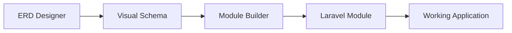

# 🎨 Database ERD Designer Module

**Advanced Visual Database Design Tool with Module Builder Integration**

A comprehensive Entity Relationship Diagram (ERD) designer built for Laravel with Filament, featuring visual database schema design, SQL import/export, and seamless integration with the Module Builder system.

## ✨ Features

### 🎨 **Visual Database Design**
- **Drag & Drop Interface**: Intuitive table positioning and management
- **Visual Field Management**: Add, edit, and organize database fields
- **Relationship Visualization**: See connections between tables
- **Multiple Database Support**: MySQL, PostgreSQL, SQLite, SQL Server

### 📊 **Advanced Table Management**
- **Complete Field Types**: All SQL data types supported
- **Primary & Foreign Keys**: Visual indicators and management
- **Indexes & Constraints**: Full constraint support
- **Field Properties**: Nullable, auto-increment, default values

### 🔄 **SQL Import/Export**
- **SQL Schema Import**: Load existing database schemas
- **SQL Script Export**: Generate complete database scripts
- **Smart Parsing**: Handles complex SQL structures
- **Multiple Formats**: Support for various SQL dialects

### 🔗 **Module Builder Integration**
- **Seamless Workflow**: ERD → Module Builder → Laravel Code
- **Automatic Conversion**: Database schema to Laravel models
- **Relationship Mapping**: ERD relationships to Eloquent relationships
- **Code Generation**: Complete modules with migrations, models, resources

### 🛡️ **Security & Permissions**
- **Role-Based Access**: Granular permission system
- **User Isolation**: Users can only access their own projects
- **Permission Integration**: Works with existing module permission system

## 🚀 Quick Start

### 1. **Access ERD Designer**
```
http://localhost:8000/admin/erd-designer-page
```

### 2. **Create Your First Project**
1. Click "Create New Project" 
2. Design your database schema visually
3. Add tables and define fields
4. Create relationships between tables

### 3. **Export to Module Builder**
1. Click "To Module Builder" in your ERD project
2. Use "Load from ERD Designer" in Module Builder
3. Generate complete Laravel module

## 📋 Database Schema

The ERD Designer uses the following database structure:

### Core Tables
- **`erd_projects`** - Main project container
- **`erd_tables`** - Database tables with positioning
- **`erd_fields`** - Table fields with full SQL type support
- **`erd_relationships`** - Visual relationships between tables
- **`erd_indexes`** - Database indexes and constraints
- **`erd_seeder_data`** - Sample data generation
- **`erd_project_versions`** - Version control for projects

## 🎯 Permissions

The ERD Designer integrates with the module permission system:

### ERD Designer Permissions
- `access_erd_designer` - Access ERD Designer interface
- `view_erd_projects` - View ERD projects
- `create_erd_projects` - Create new ERD projects
- `edit_erd_projects` - Edit existing ERD projects
- `delete_erd_projects` - Delete ERD projects
- `export_erd_projects` - Export ERD projects
- `import_erd_projects` - Import ERD projects
- `manage_erd_tables` - Manage ERD tables
- `manage_erd_fields` - Manage ERD fields
- `manage_erd_relationships` - Manage ERD relationships
- `export_sql_from_erd` - Export SQL from ERD
- `import_sql_to_erd` - Import SQL to ERD
- `integrate_erd_module_builder` - Integrate with Module Builder

### Permission Management
```bash
# Register ERD Designer permissions
php artisan permissions:register --module=ERDDesigner --guard=admin

# Setup all permissions including ERD Designer
php artisan permissions:setup --guard=admin
```

## 🔧 Configuration

### Module Configuration
The ERD Designer can be configured via `config/erddesigner.php`:

```php
return [
    'canvas' => [
        'default_zoom' => 1.0,
        'grid_size' => 20,
        'snap_to_grid' => true,
    ],
    'table' => [
        'default_width' => 200,
        'default_height' => 150,
        'default_color' => '#ffffff',
    ],
    'export' => [
        'include_drop_statements' => true,
        'include_sample_data' => false,
    ],
];
```

## 🎨 Usage Examples

### Creating a Simple E-commerce Schema

1. **Create Project**
   - Name: "E-commerce Database"
   - Description: "Online store database schema"

2. **Add Tables**
   - Users (customers)
   - Products (catalog)
   - Orders (transactions)
   - Order Items (line items)

3. **Define Relationships**
   - Users → Orders (One to Many)
   - Orders → Order Items (One to Many)
   - Products → Order Items (One to Many)

4. **Export to Module Builder**
   - Generate complete Laravel module
   - Includes models, migrations, resources

## 🔄 Integration Workflow

### ERD Designer → Module Builder → Laravel Code



1. **Design Phase**: Create visual database schema in ERD Designer
2. **Generation Phase**: Export to Module Builder for code generation
3. **Implementation Phase**: Deploy generated Laravel module

## 🛠️ Advanced Features

### SQL Import/Export
```sql
-- Import existing database schema
CREATE TABLE users (
    id BIGINT PRIMARY KEY AUTO_INCREMENT,
    name VARCHAR(255) NOT NULL,
    email VARCHAR(255) UNIQUE NOT NULL,
    created_at TIMESTAMP,
    updated_at TIMESTAMP
);
```

### Module Builder Integration
```php
// Generated Laravel Model
class User extends Model
{
    protected $fillable = ['name', 'email'];
    
    public function orders()
    {
        return $this->hasMany(Order::class);
    }
}
```

## 🎯 Best Practices

### Database Design
1. **Start Simple**: Begin with core entities
2. **Define Relationships**: Establish clear connections
3. **Use Constraints**: Implement proper foreign keys
4. **Consider Performance**: Add appropriate indexes

### Project Organization
1. **Descriptive Names**: Use clear table and field names
2. **Consistent Naming**: Follow Laravel conventions
3. **Documentation**: Add descriptions to tables and fields
4. **Version Control**: Use project versions for major changes

## 🔍 Troubleshooting

### Common Issues

**Permission Denied**
```bash
# Ensure permissions are registered
php artisan permissions:register --module=ERDDesigner --guard=admin

# Check user roles in Module Roles interface
```

**SQL Import Fails**
- Verify SQL syntax is correct
- Check for unsupported SQL features
- Ensure proper table structure

**Module Builder Integration**
- Confirm both modules are enabled
- Verify user has integration permissions
- Check for naming conflicts

## 🚀 Future Enhancements

### Planned Features
- **Advanced Canvas**: Zoom, pan, and grid controls
- **Real-time Collaboration**: Multi-user editing
- **Version Control**: Git-like project versioning
- **Template System**: Reusable schema templates
- **Database Reverse Engineering**: Import from live databases

## 📚 API Reference

### Services

#### SqlExportService
```php
$exportService = new SqlExportService();
$sql = $exportService->exportProject($project);
```

#### SqlImportService
```php
$importService = new SqlImportService();
$importService->importToProject($project, $sql);
```

## 🤝 Contributing

1. Follow Laravel and Filament best practices
2. Maintain backward compatibility
3. Add tests for new features
4. Update documentation

## 📄 License

This module is part of the Laravel Secure Admin Framework and follows the same licensing terms.

---

**Built with ❤️ for rapid Laravel development**
